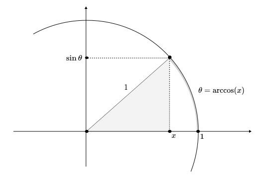

# Differential Equations for Quantum Mechanics

Before we phrase quantum mechanics more elegantly using the language of Linear Algebra, we need to understand how it works under the hood! We will do this using Ordinary and Partial Differential equations. These notes contain an accumulation of relevant results (and some proofs) for being able to talk comfortably about wavefunctions, the Schrodinger equation, eigenfunctions and so on. 

[toc]

# Ordinary Differential Equations

At the end of the day, in physics, we only ask one question:

> I am *here*, where will I be *then*?

This is a really hard question to form precisely. Sometimes *'here'* is fully described by some coordinates in $\mathbb R^n$, sometimes it is described by complicated mathematical objects that rotate slower than one would like. No matter the object the way we choose to describe evolution is by telling you where to go next. Mathematically, we express is as a condition that involves rates of change. These conditions that involve differential operators are called differential equations.

## Terminology

To that end here is some terminology 

**<u>Definition:</u>** Let $u : U\subset \mathbb R^n \to \mathbb R^m$ for some $n,m \in \mathbb N$. We say that $u$ is **smooth** iff all its partial derivatives are defined and are continuous. The **set of smooth functions** from $U\to \mathbb R^m$ is denoted by $C^\infty(U,\mathbb R^m)$. In the case where $m=1$ we often write $C^\infty(U)$ instead of $C^\infty(U,\mathbb R)$. 

Ok, why introduce smooth functions? Because when we take derivatives we take derivatives of smooth functions! This will allow us to define a differential operator as a map that takes a smooth function and spits out another smooth function.

**<u>Definition:</u>** A **linear ordinary differential operator** $L$ of order $n \in \mathbb N$ on $\mathbb R$ is a linear map $L:C^\infty(\mathbb R) \to C^\infty(\mathbb R)$ such that for any function $u\in C^\infty(U)$, i.e. a smooth function $u:\mathbb R\to \mathbb R$ is mapped to:
$$
Lu = \sum_{k=0}^n a_k \cdot \frac{d^ku}{dx^k}.
$$
where $a_k \in C^\infty(\mathbb R)$ are some other smooth functions on $\mathbb R$. If $a_k$ is constant for all $k$ then we say that $L$ has **constant coefficients**. If the operator takes in complex valued functions and output complex valued functions is called **complex.** A linear ordinary differential operator is called **non-degenerate** if $a_n$ does not vanish anywhere.

**<u>Notation:</u>** We often write
$$
L = \sum_{k=0}^n a_k \frac{d^k}{dx^k}.
$$
to denote the differential operator.

**<u>Example:</u>** Here is a list of examples

1. **The first derivative:** The first derivative is the ordinary differential operator $\frac{d}{dx}$. 

2. **The $k^{\text{th}}$ derivative:** It is given by the following operator $\frac{d^k}{dx^k}$.

3. **The Kinetic energy operator:** We will use it in quantum mechanics super soon, and is usually denoted by
   $$
   T= -\frac{1}{2m} \frac{d^2}{dx^2}.
   $$

4. **The Cauchy-Euler operator:** This is a super cool operator that will cause (or has already caused) you pain and suffering throughout your physics career and it is given by
   $$
   L = \sum_{k=0}^n x^k \frac{d^k}{dx^k}.
   $$

Ok cool, so now we can write operators. Here are some cool constructions that are super useful.

**<u>Definition:</u>** Let $L$ be a linear ordinary differential operator, and $u:\mathbb R\to \mathbb R$ a smooth function such that
$$
Lu = \lambda u,
$$
for some $\lambda \in \mathbb C$. We then call $u$ an **eigenfunction** of $L$ and $\lambda$ and **eigenvalue** of $L$.

This is terminology that you might have seen in your linear algebra class, and because $L$ is a linear operator it makes sense to adopt the same notation. We are now ready to talk about differential equations!

**<u>Definition:</u>** An **Ordinary Linear Differential Equation** is an equation of the form
$$
Lu = f,
$$
 where $f \in C^\infty(\mathbb R)$ is some known smooth function and we are trying to solve for $u \in C^\infty(\mathbb R)$. The **order of the equation** is the order of $L$. If $L$ has constant coefficients then the equation is known as an **Ordinary Linear Differential Equation with Constant Coefficients.** If $f=0$ then the equation is **homogeneous** and the $u \in C^\infty(\mathbb R)$ is known as a **homogeneous solution**. Otherwise, $u$ is known as a **particular solution**. 

> ***Exercise:*** Make up an ordinary linear differential equation that has no nontrivial (aka $u=0$) solution. Make up an ordinary linear differential equation that has **exactly two** solutions. Can you? Why or why not?

## Initial Value Problems

So far, we have answered the second half of the most fundamental question in physics; the *'where will I be.'* But to actually give an answer, or to even tell if there is one, we need to incorporate the *'I am here'* part. We do this through initial value problems. 

**<u>Definition:</u>** An **initial value problem** for a linear ordinary differential equation is a system composed of an ordinary differential equation $Lu=f$ for some ordinary differential operator $L$ of order $n$ and smooth function $f\in C^\infty$ and a **boundary condition** $B(u) = 0$ often denoted by
$$
(IVP): \begin{cases}
L u = f\\
B(u) = 0.
\end{cases}
$$
In particular, the boundary condition is a map $B:C^\infty(\mathbb R) \to \mathbb R^n$.

**<u>Notation:</u>** We will often not write the boundary condition as a map, but rather as a set of explicit conditions.

**<u>Example:</u>** *(Newton's second law)* Let the position of a particle of mass $m$ over time be given by a function $x:\mathbb R\to \mathbb R$. Then we can write the **Newton's second law** differential operator given by
$$
N = m\frac{d^2}{dt^2}.
$$
If we know that the particle has a sum of forces $F:\mathbb R\to \mathbb R$ exerted to it over time, then we can form Newton's second law as the differential equation:
$$
Nx=F \iff m \frac{d^2 x}{dt^2} = F.
$$
If in addition, we know that the particle at time $t=t_0$ passed through position $x(t_0) = x_0$ we can write the boundary condition $B:C^\infty(\mathbb R) \to \mathbb R$, given by 
$$
B(x) = x(t_0) - x_0,
$$
and finally express Newton's second law as the following initial value problem
$$
(N2) : \begin{dcases} Nx = F\\ B(x) = 0 \end{dcases} = \begin{dcases} m\frac{d^2x}{dt^2} = F \\ x(t_0) = x_0. \end{dcases}
$$

**<u>Note:</u>** Solving an ODE and solving an IVP for an ODE are two different tasks! Usually ODEs have infinite solutions. Think, for example, the ODE
$$
\frac{df}{dx} = g.
$$
if $f$ is a solution, so is $f+C$ for any $C\in \mathbb R$. However, almost all IVPs are constructed such that the boundary condition limits the possible functions that you can consider to the point that they have a unique solution. For example, we can construct an IVP for the above ODE with the boundary condition $B:C^\infty(\mathbb R) \to \mathbb R$ such that for any smooth function $u \in C^\infty(\mathbb R)$ 
$$
B(u) = u(0).
$$
Then if $f \in C^\infty(U)$ is a solution of the ODE above, such that $B(f) = f(0) = 3$. Then only the function $u(x) = f(x) - 3$ solves the IVP, because it is the only solution of the differential equation such that $B(u) = 0$.

In Quantum Mechanics we will focus on solving both situations, with an emphasis on solving ODEs instead of  IVPs.

## General Solutions

Often, if we don't have an IVP, given an ODE what we mean by *solving* it is not to find **a** solution, but rather to find **all** of them! However, they are infinite, so we can't just straight up list them. Instead, we choose to parameterize them. Here we will talk about how to do that and what does that mean exactly.

**<u>Sidenote:</u>** While we are not explicitly presenting it in this section, this construction is identical to finding the kernel of a matrix in linear algebra. In fact, this relationship is what allowed for describing quantum mechanics in the language of Linear Algebra instead of Differential Equations. While reading this, try to draw the parallel yourself!

### Linearity

Since we are studying **linear** ODEs let's see some cool results before we even start playing around with finding general solutions. One of the most amazing properties of ordinary **linear** differential equations is that the sum of homogeneous solutions is a solution. In other words the following theorems.

**<u>Theorem:</u>** *(Sum of Homogeneous Solutions)* Let $L$ be some linear ordinary differential operator and $u,v \in C^\infty(\mathbb R)$ be solutions of the equation
$$
Lu = 0.
$$
Then $\alpha u + \beta v \in C^\infty(\mathbb R)$ is a solution for any $\alpha,\beta \in \mathbb R$. 

***Proof:*** $L(\alpha u + \beta v) = \alpha Lu + \beta Lv = 0$.
$$
\begin{equation}\tag*{$\Box$}\end{equation}
$$

 **<u>Theorem:</u>** *(Sum of particular Solutions)* Let $L$ be some linear ordinary differential operator and $u,v \in C^\infty(\mathbb R)$ be solutions of the following equations
$$
\begin{align*}
Lu = f && Lv = g,
\end{align*}
$$
for some fixed functions $f,g \in C^\infty(\mathbb R)$. Then $\alpha u + \beta v \in C^\infty(\mathbb R)$ is a solution for any $\alpha,\beta \in \mathbb R$ of the equation
$$
L (\alpha u + \beta v ) = \alpha f + \beta g.
$$
***Proof:*** Do it
$$
\begin{equation}\tag*{$\Box$}\end{equation}
$$
**<u>Corollary:</u>** If $u$ is a homogeneous solution and $v$ is a particular solution, then $u+v$ is a particular solution. 

These might seem obvious, so if you ever see an equation of the form
$$
Lu = (\text{something weird}) + (\text{something weirder}),
$$
try to split it! Don't try to solve it in one go.

Linearity has a bunch more interesting properties that we are going to use very often in quantum mechanics, so we will come back to this with spicier theorems. 

### Independence

The first thing we need to do in order to parameterize all the possible solutions is to find some notion of *independence*. If we have all the *independent* solutions of an ODE, then we can use linearity to add them together with some parameters.

However, it is not obvious to establish what we mean by independent. Intuitively, if two solutions are independent from each other, then we wouldn't be able to get one from the other. The tricky part of this intuition is that what we mean by obtaining one from the other is unclear. 

Believe it or not, Taylor series come to the rescue! Why? Because they offer us a prescription to describe any smooth function.

**<u>Theorem:</u>** *(Taylor's Theorem)* Any smooth function $f \in C^\infty(\mathbb R)$ can be represented as the infinite series:
$$
f = f(0) + f'(0)x + \frac{1}{2}f''(0) x^2 + \cdots = \sum_{n=0}^\infty \frac{f^{(n)}(0)}{n!} x^n.
$$
This reminds us **of vectors**. Vectors can be represented in some basis $\{\vec e_n\}_{n=0}^k$ $v=\sum_{n=0}^k v^n \vec  e_n$, where $v^n \in \mathbb R$. Well, it looks like Taylor's theorem is giving us something like a vector description of a function in terms of the basis $\{x^n\}_{n=0}^\infty$. 

> **<u>Exercise:</u>** This is not wishy washy intuition. Prove that the set of functions $C^\infty(\mathbb R)$ is a vector space, and that $\{x^n\}_{n=0}^\infty$ is a basis for that vector space. 

Since there is this parallelism of vectors and and smooth functions, we can port our definitions of independence from Linear Algebra into this functional setting. Here is a Reminder.

**<u>Definition:</u>** Let $V$ be an $n$-dimensional vector space, and $\{v_1,v_2,\cdots, v_k\}$ be $k$ vectors. They are **linearly independent** if there is no, non-zero, linear combination of them such that they add up to zero. i.e. there are no constants $\{a^1,a^2,\cdots, a^k\} \subset \mathbb R$
$$
a^1v_1 + a^2v_2 +\cdots a^kv_k = 0.
$$
This definition while it makes sense, is a bit clunky, so what we will do is present this lemma. 

**<u>Lemma:</u>** A collection of $k$ vectors $\{v_1,v_2,\cdots, v_k\} \subset V$ of some $n$-dimensional vector space is linearly independent if the *largest leading principal minor* of the matrix with columns these vectors does not vanish i.e. the following matrix
$$
M = \begin{pmatrix}
| &| & \cdots &| \\
v_1 & v_2 & \cdots  & v_k\\
| &| & \cdots &|
\end{pmatrix},
$$

has a nonzero largest leading principal minor. BTW the $i^{\text{th}}$ leading principal minor of a matrix is the determinant of the square submatrix with $i$ columns and rows starting from the top left.

**<u>Note:</u>** The lemma only goes one way, not the other! A collection of vectors could still be linearly independent even if their largest leading principal minor is $0$.

Ok, so now what? Well, we can use it to define linear independence of functions! Let's see how.

**<u>Definition:</u>** Given $k$ smooth functions $\{f_1,f_2,\cdots, f_k\} \subset C^\infty(\mathbb R)$ they are **linearly independent** if their largest leading principal minor (aka their **Wronskian**) is nonvanishing at every point. The **Wronskian** is given by
$$
W(f_1,f_2,\cdots,f_k) = 
\begin{vmatrix}
f_1 & f_2 & \cdots & f_k \\
f_1' & f_2' & \cdots & f_k'\\
\vdots & \vdots & \ddots & \vdots \\
f_1^{(k)} & f_2^{(k)} & \cdots & f_k^{(k)}
\end{vmatrix}.
$$
This definition works because the vector space is infinite dimensional, so for any number of vectors the leading principal minor is the same!

### How Many Independent Solutions?

Now that we have defined independence perhaps it would be nice to ask, how many independent solutions could we have for a given ODE, and then use Linearity to parameterize all of them! If there is a finite number of independent solutions, then the game shifts to searching for them, instead of the infinite number of possible solutions. (By the way, for math savy readers who are screaming at their screen right now, we are ignoring singular solutions)

Here is the coolest theorem!

**<u>Theorem:</u>** *(Independence Theorem)* An $n$-th order Linear Ordinary Differential Equation has at most $n$ independent solutions.

I am not proving this theorem, because it requires theorems on Existence and Uniqueness of solutions of ODEs which is outside the scope of these notes. But it is a really powerful theorem. It tells us that if I give you an ODE, you will at most need to search for as many solutions as its order to parameterize all the possible infinite solutions. 

This theorem is amazing for both Differential Equations, as well as Quantum Mechanics. We use it, for example, to see how many possible energy states an atom has, or how many ways a spin can point, and a lot more!

## First Order ODEs

### Integration

For first order ODEs we can take advantage of the fundamental theorem of calculus to get our solution for free. Here it is by the way.

**<u>Theorem:</u>** *(Fundamental Theorem of Calculus)* Let $f \in C^\infty(\mathbb R)$ be a smooth function. Then there exists a smooth function $F \in C^\infty(\mathbb R)$ such that $f = \frac{dF}{dx}$ and
$$
\int_a^b f(x) dx = F(b) - F(a).
$$

Now we can use this fact to solve any first order linear ODE like so. 

**<u>Theorem:</u>** *(Integration Theorem)* Given any first order linear ordinary differential equation of the form
$$
a \frac{df}{dx}= g,
$$
for smooth functions $a,g\in C^\infty(\mathbb R)$ and $a$ nonvanishing, the function $f:\mathbb R\to \mathbb R$ given for any $x\in \mathbb R$ by
$$
f(x) = \int_{c}^x\frac{g(t)}{a(t)} dt
$$
for any constant $c\in \mathbb R$ is a solution to the ODE.

**<u>Example:</u>** I mean... Take this one
$$
\frac{df}{dx}(x) = \sin(x) \implies f = -\cos(x) + C,
$$
for some $C\in \mathbb R$.

> **Exercise:** Solve the following ODE
> $$
> \sin(x)\frac{df}{dx} - \cos(x) f =  \cos (x)
> $$
> *Hint:* Consider the solution of $fg'+gf' = h$ for some known functions $g,h \in C^\infty(\mathbb R)$. 

### Integration Factors

Now it is time to solve the most general first order ODEs. In particular we know that any first order linear differential operator $L$ can be written, by definition, as
$$
L = a\frac{d}{dx} + b,
$$
for known smooth functions $a,b\in C^\infty(\mathbb R)$. This means that all the equations can be written as
$$
a\frac{df}{dx} + b = c,
$$
for known smooth functions $a,b,c\in C^\infty$. This is a pretty interesting coincidence because of product rule.

**<u>Lemma</u>** *(Product rule)* Given two smooth functions $f,g \in C^\infty(\mathbb R)$ the derivative of their product satisfies
$$
\frac{dfg}{dx} = g\frac{df}{dx} + f\frac{dg}{dx}.
$$
Now we can write the following theorem that solves ANY first order linear differential equation.

**<u>Theorem:</u>** *(Method of Integrating Factors)* Let $L = a \frac{d}{dx} + b$ where $a,b \in C^\infty(\mathbb R)$ are smooth functions, be any first order non-degenerate linear operator. Then the function $f : \mathbb R\to \mathbb R$ given by
$$
f(x) = \frac{1}{\mu(x)} \int_0^x \frac{g(x) \mu(x)}{a(x)} dx,
$$
is a solution to the ODE
$$
Lf = g,
$$
for some known smooth function $g \in C^\infty(\mathbb R)$, and where $\mu : \mathbb R\to \mathbb R$ is given by
$$
\mu(x) = \exp\left[\int_0^x \frac{b(x)}{a(x)} dx\right].
$$
***Proof:*** The goal of this procedure is to convert the problem to a product rule. In particular, since $a(x) \neq 0$ for any $x \in \mathbb R$ we can rewrite the equation as
$$
Lf = g \iff \frac{df}{dx} + \frac{b}{a} f = \frac{g}{a}.
$$
Now we would like to find some function $\mu : \mathbb R\to \mathbb R$ such that when we multiply both sides of the equation we get
$$
\mu \frac{df}{dx} + \frac{b}{a} \mu f = \frac{\mu g}{a},
$$
where it makes the left hand side look like a product rule. i.e. 
$$
\mu \frac{df}{dx} + \frac{b}{a} \mu f = \frac{d\mu f}{dx} \implies \frac{d\mu }{dx} = \frac{b}{a} \mu.
$$
By noticing that
$$
\frac{d\log \mu }{dx} = \frac{1}{\mu} \frac{d\mu}{dx}
$$
we can proceed and find $\log \mu$ using the integration theorem
$$
\frac{d\log\mu}{ dx} = \frac{b}{a} \implies \log \mu(x) = \int_0^x \frac{b(t)}{a(t)} dt \iff \mu(x) =\exp\left[\int_0^x \frac{b(t)}{a(t)} dt\right].
$$
Now we can substitute $\mu$ on the ODE to obtain:
$$
\frac {d\mu f}{dx} =  \mu \frac{df}{dx} + \frac{d\mu}{dx} f = \frac{\mu g}{a} \implies (\mu f)(x) = \int_0^x\frac{\mu(t) g(t)}{a(t)}dt \iff \boxed{f(x) = \frac{1}{\mu(x)} \int_0^x\frac{\mu(t) g(t)}{a(t)}dt.}
$$
And we are done!
$$
\begin{equation}\tag*{$\Box$}\end{equation}
$$
What we have managed to do with this theorem is to **solve all first order ODEs!** This is amazing news! In fact because we are so good at solving first order ODEs, a lot of our techniques for solving higher order ODEs will be to try our hardest to convert them into 1st order.

### Integration Techniques Sidenote

Since solving first order ODEs is basically integration don't forget to use Integration techniques to solve them! Things like substitutions, by parts, as well as other calculus theorems like chain rule and the inverse of a derivative can all be applied when solving such equations!

**<u>Example:</u>** *(An almost nonlinear ODE)* Consider the disgustingly looking nonlinear differential equation
$$
\frac{df}{dx} e^f = e^{ x}.
$$
Before we panic we can take a breath and notice that
$$
\frac{de^f}{dx} = \frac{df}{dx}e^f.
$$
Therefore if we call $u = e^f$ we actually have a linear equation of the form:
$$
\frac{du}{dx} = e^{x},
$$
that we can calculate a general solution in our sleep to be
$$
u = e^x + C,
$$
for any $C\in \mathbb R$. Therefore our equation has as a solution
$$
u=e^f = e^x + C \implies f=\log(e^x + C).
$$
If we were to solve the IVP with the boundary condition $f(0) = 0$ we have $C = 0$ and the ridiculous solution $f = x$. 
$$
\begin{equation}\tag*{$\Box$}\end{equation}
$$
Things like substitutions and so on go a long way for solving ODEs. Always be on the lookout of such cool tricks to apply especially when solving physics. Here is another example:

**<u>Example:</u>** *(Ugly trigonometric functions)* Consider the following equation
$$
\frac{df}{dx} = x^2 + \sin^2 (\arccos(x)),
$$
where $f \in C^\infty(0,1)$. Here if one tries to use linearity they will probably cry. Before we brute force we can take a second to look at the super annoying term on the right. I think $\sin(\arccos(x))$ is terrible. Yet again, I see that $x \in (0,1)$, which makes me feel a bit better. Because if $x = \cos \theta$ then all my problems will be solved, because the right hand side will become
$$
(\cos\theta)^2 + \sin^2(\arccos(\cos\theta)) = \cos^2\theta + \sin^2\theta = 1.
$$
Ok so why don't we try it? If we let $x = \cos\theta$ we have to change the derivative using chain rule. In other words we have
$$
\begin{align*}
\frac{df}{dx} 
&= \frac{df}{d\cos\theta}\\
&= \frac{df}{d\theta} \frac{d\theta}{d\cos\theta}\\
&= \frac{df}{d\theta} \left(\frac{d\cos\theta}{d\theta}\right)^{-1}\\
&= -\frac{1}{\sin\theta} \frac{df}{d\theta}.
\end{align*}
$$
Plugging this back to the equation we get
$$
-\frac{1}{\sin\theta}\frac{df}{d\theta} = 1 \implies f(\theta) = \cos\theta \implies f(x)=x.
$$
WHAT? How is this even possible? We know that $\frac{df}{dx} = 1$ so could it be that the disgusting right hand side is actually 1? Here is a picture. 

In hindsight, what we could have noticed is that if $x \in (0,1)$, then we can think of it as the side of a right angle triangle that is formed by connecting a point on the unit circle and the $x$-axis.

The function $\arccos(x)$ gives us the angle of the right angle triangle between the $x$-axis and the point on the circle. We know that $\sin$ of that angle gives us the other side. Summing the squares of both sides gives us the hypotenuse, which in this case is *always* $1$ since the triangle is on the unit circle. 

A genius, I guess, could have seen it from the beginning. But for the rest of us mortals, the trig trick should be cool enough!
$$
\begin{equation}\tag*{$\Box$}\end{equation}
$$

> **<u>Exercise:</u>**  Solve the following super ugly ODE
> $$
> \frac{df}{dx} = \frac{1}{x+\cos f}.
> $$
> *Hint:* What can you do to make the fraction not a fraction?

**<u>Sidenote:</u>** Since to solve the 1st order ODEs we integrated, this term has stuck for when solving other differential equations in general. When a physicist tells you to *'integrate a Differential Equation'* they most likely mean to solve it. 

## Second Order ODEs

In (undergraduate) physics one will almost always find second order order ODEs. For example, Newton's second law is a second order ode. The reason is that while the first derivative gives us the slope of a function, the second gives us the slope of the slope, i.e. the curvature. Sometimes it is much easier to describe motion in terms of conditions on the curvature, than it is to do so in terms of the slope. 

Newton's second law, for example, tells you that Force is the curvature of the path a particle takes. So let's look into how to solve them.

### Reduction to First Order

This is a technique that want to use as most as possible, because it is easy. Again, we have solved all first order ones, so we would really like to reduce a second order to first. This is relatively simple.

**<u>Theorem:</u>** Let $L$ be a second order linear differential operator, $f \in C^\infty(\mathbb R)$ be a known function, and $A,B$ be the first order linear operators such that $L = A\circ B$. Then the ODE
$$
Lu = f,
$$
can be reduced to the system
$$
\begin{dcases}
B u = v\\
A v = f.
\end{dcases}
$$
***Proof:*** Since $Lu =A (Bu)$ we set $v = Bu$, which gives us the first equation and then we are left with $Av = f$, which is the second one. 
$$
\begin{equation}\tag*{$\Box$}\end{equation}
$$
This might look a bit abstract, but here it is in practice.

**<u>Example:</u>** Consider Newton's second law 
$$
Nx = F \iff m\frac{d^2 x}{dt^2} = F.
$$
Then we can introduce $v = \frac{dx}{dt}$ and we have the system
$$
\begin{dcases}
m\frac{dv}{dt} = F\\
v = \frac{dx}{dt}.
\end{dcases}
$$
Excellent reduction. In fact this reduction is so unbelievably useful that we gave it its own name!
$$
\begin{equation}\tag*{$\Box$}\end{equation}
$$
**<u>Example:</u>** Ok let's actually solve a real ODE. Consider the following differential equation for some known functions $\alpha, f\in C^\infty(\mathbb R)$
$$
\frac{d^2 u}{dx^2} + \alpha \frac{du}{dx} = f.
$$
Then then we can introduce an *integrating factor* $\mu$ such that $\frac{d\mu }{dx} = \mu \alpha$. Then we can rewrite the equation as
$$
\frac{d}{dx}\left( \mu \frac{du}{dx} \right) = \mu f.
$$
Then we can introduce the following system
$$
\begin{dcases}
\frac{du}{dx} = \frac{v}{\mu}\\
\frac{dv}{dx} = \mu f.
\end{dcases}
$$
Alternatively, we could immediately introduce a different system (especially if the integrating factor is ugly)
$$
\begin{dcases}
\frac{du}{dx} = v\\
\frac{dv}{dx} = f -\alpha v.
\end{dcases}
$$
Whichever looks easier. 
$$
\begin{equation}\tag*{$\Box$}\end{equation}
$$

### Straight Up Guessing

We were so good at solving first order ODEs but our luck run out. Differential Equations are really hard! In fact, we can't solve most of them. That's why we have computers do the tedious work of integrating them step by step. So it should come as no surprise that guessing is commonly used to solve ODEs.

But there is a method to the madness. We don't just guess random things, we guess with some cool theorems in mind. The most incredible one is that

**<u>Lemma:</u>** Let $p_a(x) = e^{ax}$ for some $a\in \mathbb R$, then for any linear differential operator $L$ given by
$$
L = \sum_{i=0}^n f_i \frac{d^i}{dx^i},
$$
for smooth functions $\{f_i\}_{i=0}^n \subset C^\infty(\mathbb R)$ we have that
$$
Lp_a = \sum_{k=0}^n f_k a^k,
$$
which is a polynomial associated to the operator $L$ by replacing the derivatives with powers of $a$. This is called the **characteristic polynomial**.

Why is this important? Because if this polynomial a roots, say $a_0 \in \mathbb C$ (which it always has to by the way) then 
$$
Lp_{a_0} = 0,
$$
 which implies that $p_{a_0} \in C^\infty(\mathbb R,\mathbb C)$ is a solution of the equation! So all we would need to do is to find $n$ independent of them!

**<u>Example:</u>** *(Quantum Mechanical Particle in Constant Potential)* Consider, without derivation, the time independent Schrodinger equation of a single particle of energy $E\in \mathbb R$ in a constant potential $V\in \mathbb R$. The Hamiltonian (differential) operator is given by
$$
H = T + V = -\frac{1}{2m}\frac{d^2}{dx^2} + V,
$$
where $T$ is the kinetic energy operator we mentioned before. The wavefunction $\psi \in C^\infty(\mathbb R,\mathbb C)$ (which for us is some smooth complex valued function) is given by the following Linear ODE
$$
H\psi = E \iff -\frac{1}{2m} \frac{d^2\psi}{dx^2} + V = E.
$$
To solve this we find the characteristic polynomial of $H$ which is 
$$
Hp_a = -\frac{a^2}{2m} + V.
$$
Therefore we can find solutions for it! specifically, 
$$
Hp_a = E \iff -\frac{a^2}{2m} + V = E.
$$
If you ask a kindergardner after school, they will say that the two solutions are
$$
a_\pm = \pm i \sqrt{2m(E-V)}.
$$
So we have found two solutions for this equation! They are $p_{a_\pm}$ or namely
$$
\begin{align*}
e^{i\sqrt{2m(E-V)} x} && e^{-i\sqrt{2m(E-V)}x}.
\end{align*}
$$
Are we done? I mean we have found two solutions of a second order ODE. Could the general solution given by
$$
\psi = Ae^{i\sqrt{2m(E-V)}x} + Be^{-i\sqrt{2m(E-V)}x},
$$
for some arbitrary $A,B\in \mathbb C$?

**NOT NECESSARILY!** We need to check that these are independent by calculating their [Wronskian](#Independence)! If we realize that $a_+ = -a_-$, the calculation is as follows
$$
W = \begin{vmatrix}
e^{ia_+ x} & e^{ia_- x}\\
\frac{d}{dx} e^{ia_+ x} & \frac{d}{dx} e^{ia_- x}
\end{vmatrix}
= \begin{vmatrix}
e^{ia_+ x} & e^{-ia_+ x}\\
ia_+ e^{ia_+ x} & -ia_+ e^{-ia_+ x}
\end{vmatrix}
= -ia_+ - ia_+ = -2i \sqrt{2m(E-V)} \neq 0\ \ \forall x \in \mathbb R,
$$
unless of course $E=V$, which we will not worry about now. So if this condition is satisfied, these solutions are in fact independent! So we have now solved for every possible wavefunction $\psi$ of this system!
$$
\begin{equation}\tag*{$\Box$}\end{equation}
$$

> **<u>Exercise:</u>** Find the real valued solutions of the equation
> $$
> \frac{d^2 f}{dx^2} = -\omega f,
> $$
> using the guess $e^{ax}$. Can you think of a better guess that can help you get there faster? Does this remind you of some system in classical physics?

It is not always that we will get two independent solutions via this method. But, all is not lost just yet! Here is an interesting theorem that uses the Wronskian to construct more solutions. Before we see it thought, we need to see the interesting property that it is based on.

**<u>Lemma:</u>** Let $u,v \in C^\infty(\mathbb R)$ be two solutions of a homogeneous second order linear differential equation with operator 
$$
L = \frac{d^2}{dx^2} + a\frac{d}{dx} - b.
$$
where $a,b\in C^\infty(\mathbb R)$ are known functions, then, their Wronskian satisfies
$$
W(u,v)' = -a W(u,v) \implies W(u,v)(x) = C(u,v) e^{-\int_{0}^x a(t) dt},
$$
where $C(u,v) \in \mathbb R$ is some constant that depends on $u,v$. 

This is really cool! It says that we can obtain the Wronskian directly from the equation. In other words, if we have one solution, we can figure out the Wronskian and we can get an independent new solution from its definition!

**<u>Theorem:</u>** Let $u \in C^\infty(\mathbb R)$ be two solutions of the homogeneous equation of the differential operator $L$ above. Then the solution $v\in C^\infty(\mathbb R)$ of the following system
$$
\begin{dcases}
uv'-vu'= W\\
W'= -aW,
\end{dcases}
$$
satisfies $Lv = 0$ and $W(u,v) = W \neq 0$.

We used the fact that we couldn't get a solution to our advantage!

**<u>Example:</u>** *(Independence Sucks!)* Let's see an example where independence doesn't necessarily work in our favor. Consider the following second order ODE. 
$$
\frac{d^2f}{dx^2} - 4\frac{df}{dx} + 4f = 0
$$
The characteristic polynomial equation (which can be obtained by plugging in $f=e^{ax}$) is given by
$$
a^2 -4a + 4 = 0\iff (a-2)^2 = 0 \implies a = 2.
$$
Oops. What can we do now? I mean, clearly $e^{2x}$ is a solution, but since this is a second order differential equation, we want one more to fully characterize the infinite set of solutions. We apply the theorem above. We are looking for a solution $g \in C^\infty(\mathbb R)$ that satisfies
$$
\begin{dcases}
e^{2x} \frac{dg}{dx} - 2ge^{2x} = W\\
W' = 4W.
\end{dcases}
$$
 The second equation implies that one such $W = Ce^{4 x}$ for some $C\in \mathbb R$. Therefore by plugging it in to the first equation and simplifying we get
$$
\frac{dg}{dx} - 2g = Ce^{2x}.
$$
Using integrating factors we can write this as
$$
\frac{d e^{-2x}g}{dx} = C \implies e^{-2x}g = Cx + D,
$$
for some $D\in \mathbb R$. We only need to find one $g$ such that $W\neq 0$. So we can pick the one for $C=1,D=0$ to obtain an independent solution
$$
g= xe^{2x}.
$$
So the general solution is given by $u=Af + Bg$, for arbitrary constants $A,B\in \mathbb R$. In particular, there is another way that we could have arrived to the same equations. Notice that the operator can be written as
$$
L = \frac{d^2}{dx^2} - 2\frac{d}{dx} + 4 = \left(\frac{d}{dx} - 2\right) \circ \left(\frac{d}{dx} - 2\right),
$$
which is the exact operator we have found before. So we could reduce the problem directly to the system
$$
\begin{dcases}
\frac{df}{dx} - 2f = 0\\
\frac{dg}{dx} - 2g = f,
\end{dcases}
$$
for two independent $f,g$. From here it is easy to see that $g=xf$ satisfies the equations, so if we find an $f$ the solves the first one, then so does $xf$. 
$$
\begin{equation}\tag*{$\Box$}\end{equation}
$$

# Partial Differential Equations

A partial differential equation is a differential equation with more than one variables. A lot of the constructions that we have used before still hold for partial Differential equations, so I will not copy paste them here. Others, such as Partial Differential Operators are straightforward extensions of the ordinary ones, therefore I won't copy them here as well. But just in case here are some examples.

**<u>Example:</u>** Here are some partial differential operators

1. **The Euclidean Laplacian:** It is the generalization of the second derivative and it is given by
   $$
   \Delta = \nabla^2 = \sum_{i = 0}^n\frac{\partial^2 }{\partial x_i^2},
   $$
   where $n$ is the dimension of the space.

2. **The D'Alembertian:** Another super famous differential operator which gives the wave equation
   $$
   \Box = -\frac{\partial^2}{\partial t^2} + \Delta = -\frac{\partial^2}{\partial t^2} +\sum_{i = 0}^n\frac{\partial^2 }{\partial x_i^2}.
   $$

3. **The Schrodinger Operator:** This is the differential operator of the Schrodinger equation:
   $$
   S = H - i\hbar \frac{\partial}{\partial t},
   $$
   where $H$ is the Hamiltonian Operator, usually given by
   $$
   H = T+V = -\frac{1}{2m} \Delta + V,
   $$
   where $V \in C^\infty(\mathbb R^n)$ is some potential function.

4. **The Heat Operator:** This operator is the one that guides heat transfer, and it is surprisingly similar to Schrodinger operator.
   $$
   L = \Delta - \frac{\partial}{\partial t}.
   $$
   

There are so much more that we will discuss, but the main focus of this part is to introduce main techniques by which we use to solve differential equations posed using these operators.

## Separation of Variables

Separation of Variables is a very common technique used to to create solutions that we then extend via linearity. The idea is to reduce a PDE to a bunch of ODEs one for each variable in the problem. Then we can use our super amazing ODE knowledge to solve.

**<u>Theorem:</u>** *(Separation of Variables)* Let $L:C^\infty(\mathbb R^{n+m}) \to C^\infty(\mathbb R^{n+m})$, $n,m\in \mathbb N$ be a linear partial differential operator that can be expressed (with some abuse of notation) as 
$$
L = A + B,
$$
where $A : C^\infty(\mathbb R^n) \to C^\infty(\mathbb R^n)$ and $B : C^\infty(\mathbb R^m) \to C^\infty(\mathbb R^m)$ are linear partial differential operators in their respective subspaces of $\mathbb R^{n+m}$. Then if $f \in C^\infty(\mathbb R^n)$ and $g \in C^\infty(\mathbb R^m)$ solve $Af = 0$ and $Bg = 0$ respectively, we have that the smooth function $u\in C^\infty(\mathbb R^{n+m})$ given for every point $(x,y) \in \mathbb R^{n+m}$ by 
$$
u(x,y) = f(x)g(y),
$$
solves the equation 
$$
Lu=0.
$$
***Proof:*** $L u = (A+B)u= gAf + fBg = 0$.
$$
\begin{equation}\tag*{$\Box$}\end{equation}
$$

For the sake of generality this theorem looks a lot more complicated than it actually is. Let's see how useful it is through an example.

**<u>Example:</u>** Consider the eigenvalue problem for the Laplacian in $2$D, which is given by
$$
\Delta u = \sum_{i=0}^3 D_{x_i} u = u,
$$
where $D_{x_i} = \frac{\partial^2}{\partial x_i^2}$.  We can search for solutions of the form $u(x,y) = X(x)Y(y)$. Therefore we can write the equation as
$$
YD_xX + XD_yY = XY.
$$
If we divide both sides by $XY$ we obtain
$$
\frac{D_x X}{X} + \frac{D_y Y}{Y} = 0.
$$
Now we notice something really cool. The first term is a function of only $x$, the second a function of only $y$. How is it possible that their sum is a constant for *all* values of $(x,y)$? If each term is a constant! Not only that, the constants must sum up to zero. In other words
$$
\frac{D_x X}{X} =- \frac{D_y Y}{Y} = \lambda \in \mathbb R.
$$
Therefore let's solve these equations. The are namely
$$
\begin{dcases}
X'' = \lambda X\\
Y'' = -\lambda Y.
\end{dcases}
$$

> **<u>Exercise:</u>** Solve these equations to obtain the full solution, along with the partial answer below. Can you parametrize the set of all solutions? How do you know that there aren't any more?

One such solution is $X(x) = e^{\lambda x}$, $Y(y) = e^{i\lambda y}$. Therefore a **single** solution is given by
$$
u(x,y) = X(x)Y(y) = e^{\lambda (x+iy)}.
$$

$$
\begin{equation}\tag*{$\Box$}\end{equation}
$$

> **<u>Exercise:</u>** Find the general solution of the 2-dimensional wave equation given by
> $$
> \Box u = 0 \iff -\frac{1}{c^2}\frac{\partial^2 u}{\partial t^2} + \frac{\partial^2 u}{\partial x^2} = 0.
> $$
> Why do we call the constant $c$ the "speed" of the wave $u$?

## Fourier Transforms

While we will explore the concept of the Fourier transform in more detail at another stage, in practice it finds excellent applications in  solving partial differential equations. Here is the quickest introduction I can possibly think to the Fourier transform.

It all starts with an incredible observation called Fourier's Equality.

**<u>Theorem:</u>** *(Fourier's Equality)* For any function $f : \mathbb R \to \mathbb R$ such that
$$
\int_{-\infty}^\infty |f(x)|^2 dx < \infty,
$$
Then the following equality holds for any $x \in \mathbb R$
$$
f(x) = \underbrace{\frac{1}{2\pi}\int_{-\infty}^\infty d\omega\, e^{-i\omega x}\underbrace{\int_{-\infty}^\infty dy\, e^{i\omega y} f(y)}_{\text{Fourier Transform}}}_{\text{Inverse Fourier Transform}}.
$$

This equality looks INSANE! There are all the crazy players. Integrals over infinite internals, complex numbers, even $\pi$ for crying out-loud. If you ignore the markings in the underbraces, this identity looks crazy because after all this weird integration of $f$ we end up getting back itself! 

There is a beautiful geometric intuition that you can find explained [here](https://www.youtube.com/watch?v=spUNpyF58BY), or during recitation. But for now we will use this amazing fact to chop it up as seen in the underbraces to define the Fourier transform, as the inner integral, and the inverse Fourier transform as the outer integral.

 **<u>Definition:</u>** The **Fourier transform** of a function $f:\mathbb R\to \mathbb R$ is a function $\hat f : \mathbb R \to \mathbb C$ given by
$$
\hat f(\omega) = \mathcal F[f](\omega) = \int_{-\infty}^{\infty} f(x)e^{i\omega x} dx.
$$
The **inverse Fourier transform** is given by
$$
f(x) = \mathcal F^{-1}[\hat f](x) = \frac{1}{2\pi} \int_{-\infty}^\infty f(\omega) e^{-i\omega x} d\omega.
$$

> **<u>Exercise:</u>** Calculate the Fourier transform, and inverse Fourier transform of
> $$
> f(x) = e^{-\frac{x^2}{2 \sigma}},
> $$
> for $\sigma > 0$.
>
> *Hint:* Recall that 
> $$
> \int_{-\infty}^{\infty} e^{-\frac{x^2}{2\sigma}} dx = \sqrt{2\pi \sigma}.
> $$
> How can you use this fact to calculate this very similar integral?

Ok, but so what? We are doing PDEs. The cool thing about the Fourier transform is, in fact, the integral sign! From Calculus 0.5 we have learned that integrals cancel out derivatives. And arguably the hardest part of a differential equation is the fact that it has derivatives. So what if we could use the integral of the Fourier transform to help us get rid of the Derivatives? Then we are just left with equations!

Let's see how to do this.

**<u>Proposition:</u>** The Fourier transform of the derivative is given by
$$
\mathcal F \left[\frac{df}{dx}\right](\omega) = -i\omega \mathcal F[f](\omega).
$$
Or in other words (by taking the inverse Fourier transform on both sides)
$$
\frac{df}{dx} = \mathcal F^{-1} \left[-i\omega \hat f(\omega)\right].
$$
***Proof:*** This is a result of the fact that a Fourier transform involves an integral. In particular here it is:
$$
\mathcal F \left[\frac{df}{dx}\right](\omega) = \int_{-\infty}^\infty \frac{df}{dx} e^{i\omega x} dx.
$$
We can use integration by parts to obtain
$$
\begin{align*}
\int_{-\infty}^\infty \frac{df}{dx} e^{i\omega x} dx 
&= \cancelto{0}{[f(x)e^{i\omega xx}]_{-\infty}^\infty} - i\omega\int_{-\infty}^\infty f(x) e^{i\omega x} dx\\
&= -i\omega \hat f(\omega).
\end{align*}
$$
The reason why the first term is zero, is because in order for the Fourier transform to exist, Fourier's Identity must hold, which holds only if
$$
\int_{-\infty}^\infty |f(x)|^2 dx < \infty.
$$
This implies that for really large $x\to \pm \infty$, $f(x) \to 0$ otherwise that integral would not be finite. So we have proved it!
$$
\begin{equation}\tag*{$\Box$}\end{equation}
$$
OMGOMGOMGOMGOMG! Check this out!

**<u>Example:</u>** Say that we have the following equation
$$
\frac{\partial u}{\partial t} - \frac{\partial^2 u}{\partial x^2} = e^{-x^2/2 - t}.
$$
We can write $u$ as its inverse Fourier transform of its Fourier transform in the $x$ variable like so
$$
u = \mathcal F^{-1}[\hat u].
$$
But we know that
$$
\frac{\partial u}{\partial x} = \mathcal F^{-1} \left[-i\omega \hat u(\omega)\right].
$$
 By applying this property twice we get that
$$
\frac{\partial^2 u}{\partial^2 x} = \mathcal F^{-1} \left[-\omega^2 \hat u(\omega)\right].
$$
And since $t$ has nothing to do with the Fourier transform in $x$ we can see that
$$
\frac{\partial u}{\partial t} = \mathcal F^{-1} \left[\frac{\partial \hat u}{\partial t}\right].
$$
Therefore we can write the left hand side of the equation as
$$
\frac{\partial u}{\partial t} - \frac{\partial^2 u}{\partial x^2} = \mathcal F^{-1} \left[\frac{\partial \hat u}{\partial t}\right] -\mathcal F^{-1} \left[-\omega^2 \hat u(\omega)\right] = \mathcal F^{-1} \left[\frac{\partial \hat u}{\partial t}+\omega^2 \hat u(\omega)\right].
$$
OMG and now if we take the Fourier transform on both sides (using the exercise above) we get
$$
\frac{\partial \hat u}{\partial t}+\omega^2 \hat u= e^{-t}\mathcal F[e^{-x^2/2}] = \sqrt{2\pi} e^{-t - \frac{\omega^2}{2}}.
$$
Which is first order **ODE** for $\hat u$! Which we can solve by integrating factors! (It becomes a bit tedious from here, but isn't that amazing!?)
$$
\begin{equation}\tag*{$\Box$}\end{equation}
$$
In the previous example, we have seen how to take a Fourier transform to get rid of the derivatives of a PDE entirely and reduce it to an ODE of the Fourier transform. At the end of the day, all we need to do to extract the solution after we have the Fourier transform, is to take the inverse Fourier transform back!

**<u>Example:</u>** *(A Complete Example on the Wave Equation)* The wave equation in 2 dimensions is given by
$$
\Box u = 0 \iff -\frac{1}{c^2}\frac{\partial^2 u}{\partial t^2} + \frac{\partial^2 u}{\partial x^2} = 0,
$$
for some constant $c>0$ that we usually set to 1. 

> **<u>Exercise:</u>** Another way to describe a wave is a function whose "curvature in space" is equal to its "curvature in time." Why is this wordy description identical to the wave equation? Why is it a good condition for describing wavey objects? What is the most messed up wave you can come up with?

We can calculate something really fundamental about the waves. Their frequency! We can think of a Fourier transform as a way to extract how much of each Frequency's sinusoid I should add in order to reconstruct the original function. Therefore, if the Fourier transform has a high value at some $\omega$ then the actual function must have a lot of this frequency in it.

In this case we have two variables $t,x$. We could take a Fourier transform in either one. One would give us a conjugate variable for time, which would be a temporal frequency $\omega$, or just frequency, while the other would give us a conjugate variable for space, which would be a spatial frequency $k$. 

Wouldn't it be interesting to see how our equation relates the wave's spatial frequency with the wave's time frequency? This is called a **dispersion relation**. We can find that using the Fourier transform!

We first take the Fourier transform in $x$ to obtain
$$
-\frac{1}{c^2}\frac{\partial^2 \hat u(t,k)}{\partial t^2} -  k^2 \hat u(t,k) = 0.
$$
This gets rid of the spatial derivative. To get rid of the time derivative we will take a Fourier transform in time to obtain
$$
\left(\frac{\omega^2}{c^2} - k^2\right)\hat u(\omega,k) = 0
$$
This implies that $\hat u(\omega, k) = 0 $ for **almost all** pairs of $\omega $ and $k$. The places where $\hat u$ can be anything else while still satisfying the equation is when the parenthesis at the start vanishes! In other words the only combinations of spatial and time frequencies that contribute to a wave must satisfy
$$
\omega = ck\ \text{ or }\ \omega = -ck.
$$
Which is the traditional relationship between the wavelength and frequency we have seen in Physics 1! If you want to be explicit, set
$$
\omega = 2\pi f \text{ and } k = \frac{2\pi}{\lambda}.
$$

> **<u>Exercise:</u>** What does it mean for either $\omega, k$ to be negative? Is this a physical solution?
>
> *Hint:* Yes.

